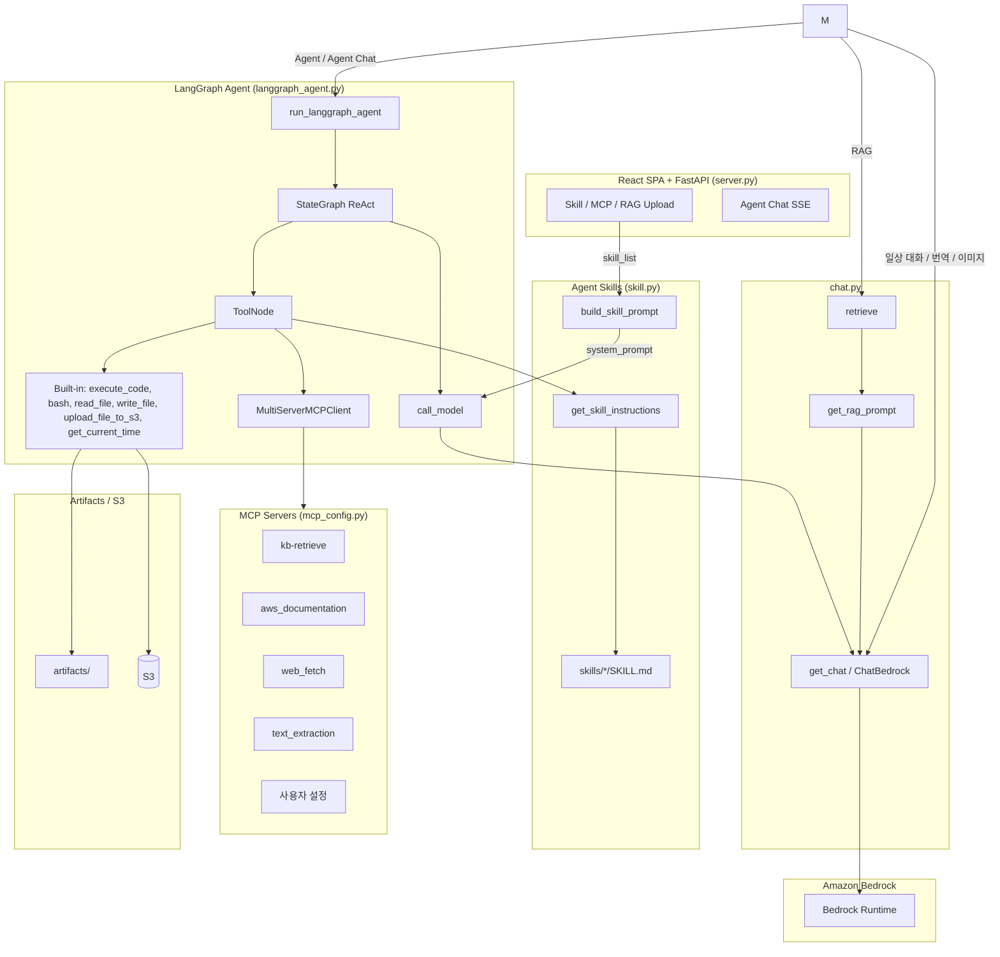

# Foundation Model Parser를 이용한 RAG 구현

## 개요

Amazon Bedrock Knowledge Bases의 **Foundation Model Parser**는 파운데이션 모델을 이용해 PDF·이미지 등 복합 문서를 파싱합니다. 기본 파서보다 도표·표·이미지 설명이 풍부하고, 파싱 프롬프트를 커스터마이즈할 수 있으며, 비용은 모델 입·출력 토큰 기준으로 산정됩니다.

전체 architecture는 아래와 같습니다. 사용자는 FastAPI + React UI로 접속해서 파일을 업로드하면 Amazon S3에 저장됩니다. 이후 Knowledge Base로 sync 요청을 하면 Foundation Model Parser로 문서가 파싱된 뒤 chunking/embedding을 거쳐 Serverless OpenSearch에 저장됩니다. 이후로 사용자가 Agent 채팅으로 질의하면 MCP를 이용해 Knowledge Base를 조회합니다. Knowledge Base는 Hybrid로 vector/keyword 검색이 가능하며, 문서 추가나 삭제가 용이합니다.


## Foundation Model Parser

Amazon Bedrock Knowledge Bases의 데이터 소스 수집(Ingestion) 단계에서 파싱 전략을 `BEDROCK_FOUNDATION_MODEL`으로 지정하면, Claude 등 지원 모델이 PDF·JPEG·PNG·구조화 문서의 텍스트와 시각 요소를 해석해 RAG 품질을 높입니다.


### Operation Architecture



### 파서 옵션 비교

Knowledge Bases에서 사용할 수 있는 파서는 세 가지입니다. **이 프로젝트는 파운데이션 모델 파서를 사용합니다.**

| 구분 | 기본 파서 (Default) | BDA 파서 | 파운데이션 모델 파서 (본 저장소) |
|------|---------------------|----------|----------------------------------|
| 지원 형식 | .txt, .md, .html, .docx, .xlsx, .pdf (텍스트만) | PDF, JPEG, PNG, 오디오, 비디오 | PDF, JPEG, PNG, 구조화 문서 |
| 멀티모달 처리 | 불가 | 가능 (이미지, 도표, 표, 오디오, 비디오) | 가능 (이미지, 도표, 표) |
| 프롬프트 커스터마이징 | 불가 | 불가 | 가능 |
| 비용 구조 | 무료 | 페이지/이미지 수 기준 과금 | 입출력 토큰 수 기준 과금 |
| 파일 크기 합계 제한 | - | - | 최대 100 GB |

> **중요:** 파운데이션 모델 파서를 선택하면 해당 데이터 소스의 모든 PDF에 적용되며, 텍스트만 있는 PDF도 과금 대상이 됩니다. 파싱 전략 타입(`BEDROCK_FOUNDATION_MODEL` ↔ `BEDROCK_DATA_AUTOMATION`)은 데이터 소스 생성 후 변경할 수 없습니다.


### 본 저장소 Knowledge Base 설정

`installer.py`는 Knowledbe Base를 아래와 같이 설정합니다.

- **파싱 전략:** `BEDROCK_FOUNDATION_MODEL`
- **파싱 모델:** `global.anthropic.claude-sonnet-4-6` inference profile
- **청킹:** Hierarchical (1500 / 300, overlap 60) + Titan Embed v2

| 항목 | 값 |
|------|-----|
| 파싱 전략 | `BEDROCK_FOUNDATION_MODEL` |
| 파싱 모델 | `arn:aws:bedrock:{region}:{account-id}:inference-profile/global.anthropic.claude-sonnet-4-6` |
| Chunking | `HIERARCHICAL` — parent 1500 / child 300 tokens, overlap 60 |
| Embedding | `amazon.titan-embed-text-v2:0` (1024 dim) |
| Data source prefix | `docs/{project_name}/` |
| Vector store | OpenSearch Serverless |


### API 구성 방법

데이터 소스 생성 시 `vectorIngestionConfiguration.parsingConfiguration`을 아래와 같이 설정합니다.

#### ParsingConfiguration 구조

```json
{
  "parsingStrategy": "BEDROCK_FOUNDATION_MODEL",
  "bedrockFoundationModelConfiguration": {
    "modelArn": "arn:aws:bedrock:us-west-2:<account-id>:inference-profile/global.anthropic.claude-sonnet-4-6"
  }
}
```

- `parsingStrategy`: `BEDROCK_FOUNDATION_MODEL`
- `modelArn`: 파싱에 사용할 파운데이션 모델(또는 inference profile) ARN
- 선택적으로 `parsingModality: MULTIMODAL`, `parsingPrompt`를 추가할 수 있음
- 파운데이션 모델 파서가 실패하면 기본 파서로 폴백(fallback)

#### `installer.py` 핵심 코드

```python
parsing_model_arn = (
    f"arn:aws:bedrock:{region}:{account_id}:inference-profile/global.anthropic.claude-sonnet-4-6"
)

vectorIngestionConfiguration={
    "chunkingConfiguration": {
        "chunkingStrategy": "HIERARCHICAL",
        "hierarchicalChunkingConfiguration": {
            "levelConfigurations": [
                {"maxTokens": 1500},
                {"maxTokens": 300},
            ],
            "overlapTokens": 60,
        },
    },
    "parsingConfiguration": {
        "parsingStrategy": "BEDROCK_FOUNDATION_MODEL",
        "bedrockFoundationModelConfiguration": {
            "modelArn": parsing_model_arn,
        },
    },
}
```


### IAM 권한 구성

Foundation Model Parser는 Knowledge Base 역할에 Bedrock 모델 호출 권한이 필요합니다. `installer.py`의 `create_knowledge_base_role()`이 아래를 포함합니다.

```json
{
  "Effect": "Allow",
  "Action": [
    "bedrock:InvokeModel",
    "bedrock:InvokeModelWithResponseStream",
    "bedrock:GetInferenceProfile",
    "bedrock:GetFoundationModel"
  ],
  "Resource": [
    "arn:aws:bedrock:<region>:<account-id>:inference-profile/*",
    "arn:aws:bedrock:<region>:*:inference-profile/*",
    "arn:aws:bedrock:*::foundation-model/*"
  ]
}
```

추가로 S3(`s3:*`) 및 OpenSearch Serverless(`aoss:APIAccessAll`) 권한이 필요합니다.


### 주요 활용 사례

- **복합 PDF RAG:** 도표·차트·표가 포함된 기술 문서의 시맨틱 검색
- **프롬프트 커스텀 파싱:** 도메인별 추출 지침이 필요한 계약서·보고서 처리
- **Agent + MCP retrieve:** LangGraph 에이전트가 Knowledge Base를 도구로 조회
- **사용자별 문서 스코프:** metadata sidecar(`owner` STRING_LIST) + `listContains` 필터


## 프로젝트 구조

본 프로젝트는 크게 **AWS 인프라 자동화 스크립트**(루트 레벨)와 **FastAPI + React 기반 RAG Agent 애플리케이션**(`application/`)으로 구성되어 있습니다.

```
rag-foundation-model/
├── README.md                  # 프로젝트 개요 및 Foundation Model Parser/RAG 가이드 (본 문서)
├── requirements.txt           # Python 패키지 의존성 정의
├── run_local.sh               # 프론트 빌드 + uvicorn :8501
├── Dockerfile                 # FastAPI + React 컨테이너
│
├── installer.py               # AWS 인프라 일괄 배포 스크립트 (boto3)
├── installer.md               # installer.py 상세 문서 (생성 리소스/배포 순서)
├── uninstaller.py             # installer.py가 생성한 리소스 일괄 삭제 스크립트
│
└── application/               # FastAPI + React 기반 Agent / RAG 애플리케이션
    ├── server.py              # FastAPI 진입점 + SPA 서빙
    ├── api/                   # REST/SSE 라우트
    ├── web/                   # React Vite SPA
    ├── services/              # rag_service 등
    ├── chat.py                # Bedrock 호출, RAG/이미지 분석 등 채팅 로직 핵심
    ├── info.py                # 사용 가능한 Bedrock 모델 카탈로그 정의
    ├── langgraph_agent.py     # LangGraph 기반 ReAct 에이전트 그래프 정의
    ├── mcp_config.py          # MCP 서버 프로파일 로더 (KB, AWS Docs, Tavily 등)
    ├── mcp_retrieve.py        # Bedrock Knowledge Base retrieve API 래퍼
    ├── mcp_server_retrieve.py # FastMCP 기반 KB retrieve MCP 서버 진입점
    ├── utils.py               # 공통 유틸리티 (설정 로드, 시크릿 조회 등)
    └── config.json            # 런타임 설정 (region, KB ID, S3 버킷, ARN 등)
```

### 루트 레벨 구성요소

| 파일 | 역할 |
|------|------|
| `installer.py` | S3, IAM, Secrets Manager, OpenSearch Serverless, VPC, ALB, CloudFront, EC2, Bedrock Knowledge Base를 순서대로 생성합니다. **Foundation Model Parser**가 적용된 Knowledge Base를 자동으로 구성하고, 결과를 `application/config.json`에 기록합니다. 자세한 내용은 `installer.md` 참조. |
| `uninstaller.py` | `installer.py`가 만든 모든 AWS 리소스를 의존성 역순으로 안전하게 삭제합니다. |
| `requirements.txt` | `fastapi`, `uvicorn`, `boto3`, `langchain_aws`, `langgraph`, `mcp`, `langchain-mcp-adapters` 등 애플리케이션 실행에 필요한 Python 패키지를 정의합니다. |
| `run_local.sh` | React 프론트 빌드 후 `uvicorn application.server:app`를 포트 8501에서 기동합니다. |

### `application/` 디렉터리 구성요소

| 파일 | 역할 |
|------|------|
| `server.py` | FastAPI 진입점. `/api/*` 라우터와 React `web/dist` SPA를 동일 프로세스에서 서빙합니다. |
| `web/` | Vite + React UI (Agent 채팅, Skill/MCP 선택, RAG 업로드, 로컬 User ID 세션). |
| `api/` | 세션·설정·태스크·채팅 SSE·파일/RAG 업로드 라우트. |
| `chat.py` | 핵심 비즈니스 로직. `run_agent()`로 FastAPI에서 LangGraph 에이전트를 동기 실행합니다. |
| `info.py` | Nova Premier/Pro/Lite/Micro, Claude 등 사용 가능한 Bedrock 모델과 리전별 모델 ID를 카탈로그 형태로 정의합니다. |
| `langgraph_agent.py` | LangGraph `StateGraph` 기반 ReAct 에이전트를 정의합니다. MCP 툴을 바인딩한 LLM 노드와 `ToolNode`를 연결해 도구 호출 루프를 실행합니다. |
| `mcp_config.py` | 선택된 MCP 서버 종류(`RAG`, `aws_documentation`, `websearch`, 사용자 설정 등)에 따라 `MultiServerMCPClient`가 사용할 설정을 동적으로 빌드합니다. |
| `mcp_retrieve.py` | `bedrock-agent-runtime.retrieve`로 Hybrid 검색 + `owner` metadata 필터(`listContains`)를 적용합니다. MCP env의 `RAG_USER_ID`로 사용자 스코프를 강제합니다. |
| `mcp_server_retrieve.py` | `FastMCP`로 노출되는 MCP 서버. `retrieve` 툴 하나를 제공하며 내부적으로 `mcp_retrieve.retrieve`를 호출하여, 에이전트가 RAG 검색을 도구로 사용할 수 있도록 합니다. |
| `utils.py` | `config.json` 로드, S3 업로드, KB sync, 사용자 세션 디렉터리 등 공통 헬퍼. |
| `config.json` | `installer.py` 실행 결과로 생성/갱신되며 `region`, `projectName`, `accountId`, `knowledge_base_id`, `collectionArn`, `s3_bucket`, `sharing_url`(CloudFront 도메인) 등 런타임에서 참조하는 핵심 식별자를 보관합니다. |

### 실행 흐름 요약

1. **인프라 프로비저닝** — `python installer.py` 실행 시 Foundation Model Parser가 적용된 Knowledge Base와 EC2/ALB/CloudFront 스택이 생성되고 `application/config.json`이 자동으로 채워집니다.
2. **콘텐츠 적재** — `python add_content.py` 로 로컬 파일을 S3에 업로드하고 Foundation Model Parser 기반 인제스션 잡을 트리거합니다.
3. **애플리케이션 실행** — `uvicorn application.server:app --port 8501` (또는 `./run_local.sh`)로 FastAPI + React UI를 기동하며, CloudFront 도메인을 통해 외부에서 접속합니다.
4. **질의 처리** — React UI에서 Agent 채팅을 보내면 `/api/tasks/{id}/chat` SSE → `chat.run_agent` → `langgraph_agent`로 Skill/MCP(RAG 포함) 도구를 호출합니다.


### Multimodal Parser 적용시 비용


## Metadata Filtering (OpenSearch + Foundation Model Parser)

Amazon Bedrock Knowledge Bases는 원본 문서와 함께 `파일명.확장자.metadata.json` sidecar를 S3에 올리면 문서별 커스텀 메타데이터를 인덱싱합니다.
조회 시 `Retrieve`의 `vectorSearchConfiguration.filter`로 사전 필터링한 뒤 유사도/하이브리드 검색을 수행합니다.

- 문서: [Include metadata](https://docs.aws.amazon.com/bedrock/latest/userguide/kb-metadata.html)
- 검색 옵션: [Configure queries](https://docs.aws.amazon.com/bedrock/latest/userguide/kb-test-config.html) (`overrideSearchType`, metadata filters)
- 파서: [Parsing options / Foundation models](https://docs.aws.amazon.com/bedrock/latest/userguide/kb-advanced-parsing.html) — Foundation Model Parser는 인제스션 시 복합 PDF/이미지를 텍스트로 파싱하며, metadata sidecar 인덱싱과는 독립입니다.

이 프로젝트(OpenSearch Serverless)는 UI/API RAG 업로드 시 `application/services/rag_service.py`가
`docs/{projectName}/{user_id}/{file}.metadata.json` sidecar를 함께 올립니다.

### OpenSearch에서 허용되는 타입

OpenSearch Serverless는 `STRING` / `NUMBER` / `BOOLEAN` / **`STRING_LIST`** 를 지원합니다.

| 속성 | 타입 | 예시 | 용도 |
|------|------|------|------|
| `owner` | `STRING_LIST` | `["user01"]` | 업로더 `user_id` (listContains 필터) |
| `team` | `STRING` | `"mycompany"` | 팀/조직 스코프 |
| `created_time` | `NUMBER` | `1786366000` | Unix epoch(초). 범위 필터용 |
| `is_confidential` | `BOOLEAN` | `false` | 기밀 여부 |

> Neptune GraphRAG는 list 메타데이터를 거부하므로 `STRING` + `equals`를 씁니다.  
> 본 저장소(OpenSearch)는 `STRING_LIST` + `listContains`를 사용합니다.

메타데이터 파일 예시:

```json
{
  "metadataAttributes": {
    "owner": {
      "value": { "type": "STRING_LIST", "stringListValue": ["user01"] },
      "includeForEmbedding": false
    },
    "team": {
      "value": { "type": "STRING", "stringValue": "mycompany" },
      "includeForEmbedding": false
    },
    "created_time": {
      "value": { "type": "NUMBER", "numberValue": 1786366000 },
      "includeForEmbedding": false
    },
    "is_confidential": {
      "value": { "type": "BOOLEAN", "booleanValue": false },
      "includeForEmbedding": false
    }
  }
}
```

### 검색 설정

`mcp_retrieve.retrieve()` / `chat.retrieve()` 기본값:

```python
retrievalConfiguration={
    "vectorSearchConfiguration": {
        "numberOfResults": 5,
        "overrideSearchType": "HYBRID",  # OpenSearch: vector + keyword
        "filter": {
            "listContains": {"key": "owner", "value": "<user_id>"}
        },
    }
}
```

- **HYBRID**: OpenSearch Serverless에서 벡터 + 원문 키워드 검색 (Foundation Model Parser로 추출된 텍스트 청크에도 적용).
- **owner 필터**: `langgraph_agent.create_agent()`가 RAG MCP(`kb-retrieve`)에 `RAG_USER_ID`를 주입하고, retrieve는 해당 사용자 문서만 반환합니다.
- **페이지 번호**: OpenSearch + PDF에서 KB가 `x-amz-bedrock-kb-document-page-number`를 부여하면 참조에 1-based page로 표시합니다.


## 설치 및 실행

여기서는 [installer.py](./installer.py) 하나로 RAG 시스템 구동에 필요한 AWS 인프라(S3, OpenSearch Serverless, Bedrock Knowledge Base, VPC, ALB, CloudFront, EC2)를 일괄 배포하고, 애플리케이션은 FastAPI(`uvicorn application.server:app`, 포트 8501)로 기동하도록 설계되어 있습니다.

### 사전 준비 (Prerequisites)

| 항목 | 요구사항 |
|------|----------|
| AWS 계정 | 관리자 권한 또는 인프라 생성 권한 (IAM, S3, EC2, VPC, ALB, CloudFront, OpenSearch Serverless, Bedrock, Secrets Manager) |
| AWS 리전 | `us-west-2` (기본값, Claude / Titan Embed / Nova 모델 사용 가능 리전) |
| Bedrock 모델 액세스 | AWS 콘솔 → Bedrock → **Model access** 에서 사용할 모델(Nova, Claude, Titan Embed v2 등) 활성화 필요 |
| Python | 3.10 이상 |
| AWS CLI | 자격증명 설정 완료 (`aws configure` 또는 SSO) |

### 1단계: 저장소 클론 및 의존성 설치

```bash
git clone https://github.com/kyopark2014/rag-foundation-model && cd rag-foundation-model

pip install -r requirements.txt
```

### 2단계: AWS 자격증명 설정

`installer.py`, `uninstaller.py`, `add_content.py` 모두 boto3 기본 자격증명 체인을 사용합니다. 다음 중 하나를 구성하세요.

```bash
aws configure                      # Access Key 방식
```

기본 리전 및 프로젝트명은 `installer.py` 상단에서 수정할 수 있습니다.

```python
project_name = "rag-automation"   # 최소 3자
region = "us-west-2"
```

### 3단계: AWS 인프라 배포

루트 디렉터리에서 `installer.py`를 실행하면 약 15~25분에 걸쳐 모든 리소스가 생성됩니다.

```bash
python installer.py
```

배포가 완료되면 콘솔에 다음 정보가 출력되고 `application/config.json`이 자동으로 채워집니다.

```
================================================================
Infrastructure Deployment Completed Successfully!
================================================================
  S3 Bucket:           storage-for-rag-project-<account_id>-us-west-2
  Knowledge Base ID:   XXXXXXXXXX
  OpenSearch Endpoint: https://xxxxxxxx.us-west-2.aoss.amazonaws.com
  ALB DNS:             http://alb-for-rag-automation-xxxx.us-west-2.elb.amazonaws.com/
  CloudFront URL:      https://xxxxxxxxx.cloudfront.net
================================================================
```

> CloudFront 배포는 완전히 활성화되기까지 15~20분이 추가로 소요될 수 있습니다. 자세한 옵션(`--run-setup`, `--verify-deployment`)과 생성 리소스 명세는 [`installer.md`](installer.md) 참조.


### 4단계: 문서 적재 및 Knowledge Base 동기화

배포가 끝나면 UI에서 파일을 업로드하면 문서와 함께 `.metadata.json` sidecar가 올라가고 Knowledge Base sync가 수행됩니다. 진행 상황은 AWS 콘솔 → **Bedrock → Knowledge Bases → 데이터 소스 → Sync history** 에서 확인할 수 있습니다.

### 로컬에서 애플리케이션 실행

로컬에서 아래처럼 UI를 띄워 테스트할 수 있습니다.

```bash
# 프론트 빌드 후 uvicorn (포트 8501)
./run_local.sh
```

또는 수동으로:

```bash
cd application/web && npm install && npm run build && cd ../..
uvicorn application.server:app --host 0.0.0.0 --port 8501
```

개발 시 HMR:

```bash
uvicorn application.server:app --host 0.0.0.0 --port 8501
cd application/web && npm run dev   # http://localhost:5173  (/api → :8501 프록시)
```

브라우저에서 `http://localhost:8501` 로 접속한 뒤 User ID로 로컬 세션을 시작합니다. Knowledge Base / S3 / Bedrock 호출은 모두 `config.json`에 기록된 리전·KB ID·역할을 통해 이루어집니다.

### 리소스 정리 (Uninstall)

테스트가 끝났다면 `uninstaller.py`로 `installer.py`가 만든 모든 리소스를 안전하게 삭제합니다.

```bash
python uninstaller.py            # 확인 프롬프트 표시
python uninstaller.py --yes      # 프롬프트 없이 즉시 삭제
```

CloudFront 비활성화에 시간이 걸려 일부 리소스가 남을 수 있으며, 이 경우 안내 메시지에 따라 잠시 후 다시 실행하면 됩니다.

### 문제 해결 (Troubleshooting)

| 증상 | 확인 사항 |
|------|----------|
| `AccessDeniedException` (Bedrock 호출) | Bedrock **Model access**에서 사용 모델(Claude Sonnet 4.6, Titan Embed v2 등)을 활성화했는지, IAM 역할에 `bedrock:InvokeModel` / `bedrock:GetInferenceProfile` 권한이 있는지 확인 |
| `ResourceNotFoundException` (Knowledge Base) | `application/config.json`의 `knowledge_base_id`가 실제 KB와 일치하는지 확인 (mismatch 시 `mcp_retrieve.py`가 프로젝트명 기준으로 자동 복구 시도) |
| CloudFront 도메인 502/503 | 배포 직후 15~20분 활성화 대기, EC2 인스턴스 상태 및 ALB 타겟 그룹 헬스 확인 (포트 8501) |
| `add_content.py` 실행 시 config 로드 실패 | `python installer.py`로 인프라 배포가 정상 완료되어 `application/config.json`이 생성되었는지 확인 |
| Foundation Model Parser 인제스션 실패 | 파싱 모델 액세스·inference profile ARN이 올바른지, 파일이 FM 파서 지원 형식인지, 비밀번호로 보호된 PDF가 아닌지 확인 |


## 실행 결과

채팅창의 '+' 버튼을 눌러서 [Upload to RAG]를 선택후 파일을 업로드 합니다. 업로드후 Amazon S3를 보면 아래와 같이 업로드한 "error_code.pdf"에 더해 "error_code.pdf.metadata.json"가 업로드 됩니다. sidecar 스키마·필터 연산자는 [Metadata Filtering](#metadata-filtering-s3-vectors--bedrock-knowledge-bases)을 참고하세요.


이때, "error_code.pdf.metadata.json"에는 아래와 같이 문서의 owner, team과 함께 생성시간 정보가 함께 기입됩니다.

```json
{
  "metadataAttributes": {
    "owner": {
      "value": {
        "type": "STRING_LIST",
        "stringListValue": [
          "user01"
        ]
      },
      "includeForEmbedding": false
    },
    "team": {
      "value": {
        "type": "STRING",
        "stringValue": "mycompany"
      },
      "includeForEmbedding": false
    },
    "created_time": {
      "value": {
        "type": "NUMBER",
        "numberValue": 1786452602
      },
      "includeForEmbedding": false
    },
    "is_confidential": {
      "value": {
        "type": "BOOLEAN",
        "booleanValue": false
      },
      "includeForEmbedding": false
    }
  }
}
```

이후 "보일러 에러 코드"라고 입력하면 아래와 같은 결과를 얻을 수 있습니다. 이때 Knowledge Base를 조회하는 retrieve tool이 이용되었습니다.


## 참고 문서 링크

| 문서 | URL |
|------|-----|
| Parsing options for your data source | https://docs.aws.amazon.com/bedrock/latest/userguide/kb-advanced-parsing.html |
| Customize ingestion for your data source | https://docs.aws.amazon.com/bedrock/latest/userguide/kb-data-source-customize-ingestion.html |
| ParsingConfiguration API Reference | https://docs.aws.amazon.com/bedrock/latest/APIReference/API_agent_ParsingConfiguration.html |
| BedrockFoundationModelConfiguration API | https://docs.aws.amazon.com/bedrock/latest/APIReference/API_agent_BedrockFoundationModelConfiguration.html |
| Supported models and Regions for parsing | https://docs.aws.amazon.com/bedrock/latest/userguide/knowledge-base-supported.html |
| Create a knowledge base | https://docs.aws.amazon.com/bedrock/latest/userguide/knowledge-base-create.html |
